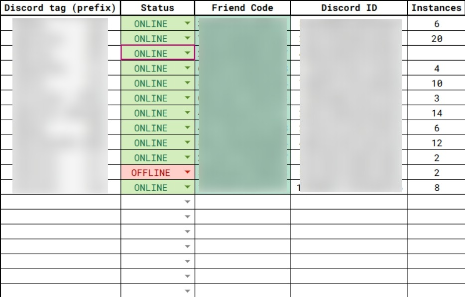
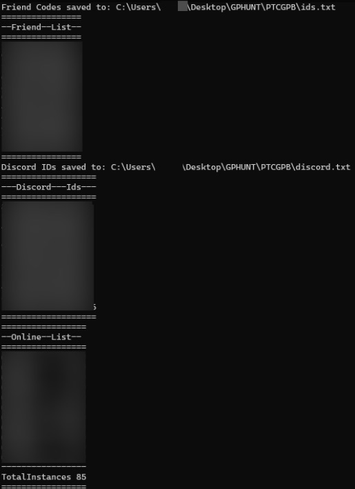

# PTCGPB_auto_refresh_ids
 
# README

## Example Images

### 1. Excel Sheet Filled by the Team  
This is an example of the Excel file used to collect data.  

### 2. Google Script Response  
Example of a response generated by the Google Apps Script.  

### 3. Batch Output  
Result of the batch script execution.  

## Overview

This repository contains three files designed to manage and refresh a shared ID list. The files work together to automate the update process and integrate with Google Apps Script.

## Files Description

### 1. `Shared ID List_template.xlsx`

- This is an Excel template that contains a structured format for storing shared IDs.
- Users should fill in this template with the relevant data.
- The file can be used as a reference for updates and automation.

### 2. `google_script.js`

- This is a Google Apps Script file.
- It is designed to read information from the Excel file and return the data via a `doGet` request.

### 3. `id_refresher.bat`

- This is a batch script designed to automate the execution of certain tasks.
- It calls the Google API and updates the files `ids.txt` and `discord.txt` in the `PTCGPB` folder.
- Running this file will execute the predefined automation workflow.

## Usage

1. **Upload the Excel file**: `Shared ID List_template.xlsx` should be uploaded to Google Drive.
2. **Deploy Google Apps Script**:
   - Upload and configure `google_script.js` within Google Sheets or Google Apps Script editor.
   - Insert the reference to the Google Sheet file ID in the source of google\_script.js.
3. **Run the batch script**:
   - Execute `id_refresher.bat`, specifying the URL where the Google Script is exposed to send a cURL.

## Requirements

- A valid Google account to use Google Apps Script.
- Windows OS (for executing the batch file).
- Microsoft Excel or a compatible spreadsheet application.

---

If you have any questions, feel free to open an issue or reach out to the repository maintainers.

